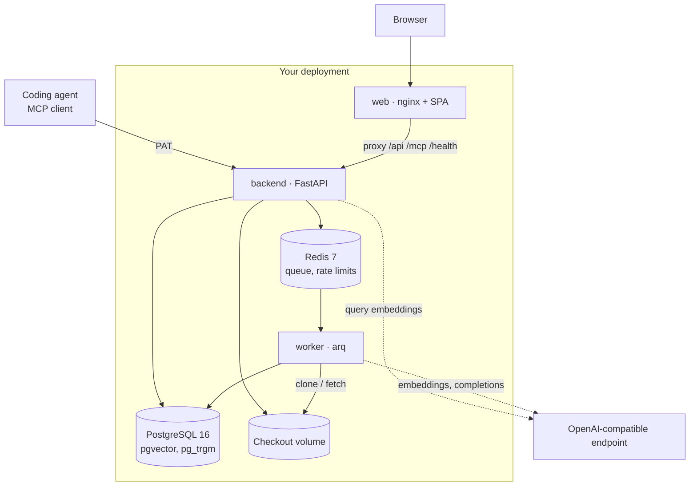
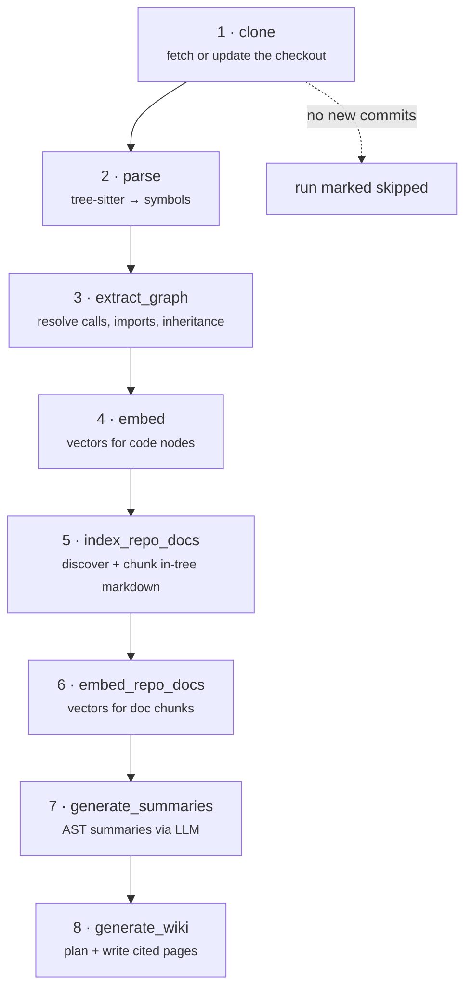

# Architecture

## Components

Four processes and two datastores. The LLM endpoint is the only thing outside the
trust boundary.

| Component | Responsibility |
| --- | --- |
| **web** | nginx serving the built SPA. Proxies `/api/`, `/mcp` and `/health` to the backend; everything else falls through to the single-page app. |
| **backend** | FastAPI. REST API, the MCP server mounted at `/mcp`, SCIM at `/scim/v2`, auth, and enqueueing pipeline work. |
| **worker** | An [arq](https://arq-docs.helpmanual.io/) worker running the indexing pipeline, the scheduler tick, the stale-run sweep and log pruning. Can run as its own deployment or as a sidecar. |
| **PostgreSQL** | The system of record for everything. |
| **Redis** | Job queue, and distributed rate limiting. |
| **Checkout volume** | Git working copies. Shared between backend and worker, which is why its access mode matters on Kubernetes. |

Only the backend and worker talk to the model endpoint. Browsers and agents never
hold a provider key.

## The indexing pipeline

Eight steps, always in this order. The list is defined once in the code and
drives both the worker and the jobs UI, so what you see in `/jobs` is what runs.

Each step gets its own deadline and writes its own job row with progress, unit
counts and LLM spend. A step whose capability is unconfigured — no
`completion_writer`, so no wiki — is recorded as **skipped with a reason**, not
as a failure.

## Four design choices

These are the decisions that shape everything else. Each has a cost, named.

### AST first, LLM second

Structure is derived deterministically before any model is consulted. Functions,
classes, methods, modules, references, line ranges and file metadata come from
tree-sitter and SQL queries.

Models are used for *synthesis only*: writing wiki pages, summarising indexed
evidence, producing explanations. They operate over retrieved context and must
cite source-backed nodes or documents.

*The cost:* precise extraction only exists for languages with a walker
implemented — currently four. Everything else contributes text but no symbols.

### One operational database

PostgreSQL holds graph nodes and edges, source files, chunks, generated pages,
`pgvector` embeddings, full-text and trigram indexes, and ordinary application
state. There is no separate graph or vector service.

*The cost:* some graph traversals are more awkward in SQL than in a purpose-built
query language, and deep traversal is capped rather than unbounded. *The
benefit:* one backup, one connection pool, one transaction — ingest and
application state commit together — and a single-node install is genuinely a
single node.

### Hybrid retrieval, not one magic index

Three retrieval streams run in parallel over up to three stores and their
rankings are fused. Exact symbol lookup stays precise while conceptual questions
still reach the right prose. A stream that fails degrades to empty rather than
failing the query.

*The cost:* more moving parts than a single vector index, and several tuning
knobs that interact. [Retrieval](/retrieval) documents them.

### Durable jobs with per-step deadlines

Indexing is a queue of durable jobs, not a long HTTP request. Every step is
wrapped in its own timeout, so a hung model call fails *that step* with a
`step_timeout` code instead of poisoning the run. A worker that dies mid-run
leaves a row marked `running` forever, which would silently deduplicate every
later reindex — so a sweep runs every 15 minutes, checks whether the queue still
holds a live task, and fails orphaned runs with `worker_died`.

*The cost:* the queue never retries automatically (`max_tries = 1`, deliberately,
so a two-hour job cannot silently re-fire). Recovery is the sweep plus a manual
retry.

## Reads survive a failed write

Worth stating separately, because it explains behaviour you will see: the outcome
of the last sync and the availability of the indexed snapshot are separate
concerns.

- If a repository has **never** indexed successfully, a failure sets its status
  to `error` — there is nothing to serve.
- If a prior snapshot exists (`last_commit` is set), the status returns to
  `ready` and the failure is surfaced as a warning strip on the repository card.
  MCP and the REST API keep serving the last good commit.

The same rule holds while a re-sync is in flight: the phase advance never demotes
a `ready` repository, so re-indexing an existing repository does not take it
offline.

## Where the code lives

| Area | Path |
| --- | --- |
| Pipeline orchestration and steps | `backend/app/pipeline/` |
| tree-sitter extraction and graph build | `backend/app/graph/` |
| Retrieval, fusion, rerank, routing | `backend/app/rag/` |
| Wiki generation | `backend/app/wiki/` |
| MCP server, tools, resources | `backend/app/mcp/` |
| REST routers | `backend/app/api/` |
| Markdown collections | `backend/app/md_rag/` |
| In-tree docs discovery | `backend/app/repo_docs/` |
| Models and migrations | `backend/app/models/`, `backend/app/db/migrations/` |
| Frontend | `web/src/` |
| Helm chart | `helm/cograph/` |

## Stack

| Layer | Technology |
| --- | --- |
| Backend | Python 3.12+, FastAPI, SQLAlchemy 2.0, Alembic, gunicorn + uvicorn worker |
| Storage | PostgreSQL 16, pgvector, pg_trgm, full-text search |
| Queue | Redis 7, arq |
| Parsing | tree-sitter via `tree-sitter-language-pack` |
| LLM runtime | Any OpenAI-compatible HTTP API |
| Agent protocol | MCP Python SDK, streamable HTTP |
| Frontend | React 19, Vite, TypeScript, Tailwind v4, TanStack Query, React Router |
| Deployment | Docker Compose, Helm |
