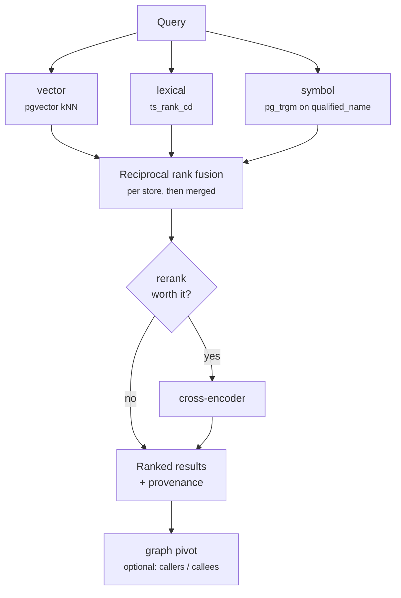

# Retrieval

How a question becomes an answer. This page is the internals; if you only want to
call it, see [REST API](/api) or [MCP server](/mcp).

## The shape of the problem

Developers type three very different kinds of query:

| Query | What it needs |
| --- | --- |
| `ParseConfig` | Exact symbol lookup |
| `func (s *Server) Handle` | Signature / lexical matching |
| "how does billing retry a failed charge" | Semantic matching over prose and code |

No single index is good at all three. Dense vectors miss exact identifiers;
full-text search with English stemming mangles them; symbol lookup cannot answer
a conceptual question. Cograph runs all three approaches for every query and
fuses their rankings.

## Layers, stores, streams

Three orthogonal ideas that are easy to conflate.

**Layers** are what a caller asks for — the kind of result they want back:

| Layer | Content |
| --- | --- |
| `code` | A code node's body |
| `ast` | A code node's signature only |
| `ast_summary` | The LLM-written summary of a node or subgraph |
| `repo_doc` | A chunk of the repository's own markdown |

Broad searches use `code`, `ast_summary` and `repo_doc`. The bare `ast` layer is
deliberately excluded, because it returns the same node as `code` with only the
signature as its snippet — pure duplication in a token budget.

**Stores** are the physical indexes: `code`, `repo_docs`, and `md_collections`.
The first three layers map to the `code` store, `repo_doc` maps to `repo_docs`.
The collections store is reached through the collection-search path rather than
through general retrieval.

**Streams** are the retrieval methods. All of them contribute to one fused
result:



| Stream | Mechanism | Runs when |
| --- | --- | --- |
| **vector** | `pgvector` cosine kNN, score `1 - distance` | Always |
| **lexical** | PostgreSQL `ts_rank_cd` full-text | Only when the query has text |
| **symbol** | `pg_trgm` similarity on `qualified_name`, threshold `0.3` | `code` store only |

::: warning Streams execute sequentially, not in parallel
The three streams are logically a fan-out, but the implementation awaits them one
after another, and the stores in turn. A query against the `code` store issues
three sequential round trips, not three concurrent ones.

That matters for latency planning: query time is roughly the **sum** of the
streams, not the slowest one. It also means `candidate_cap` and the number of
stores multiply into wall-clock time. Nothing about correctness depends on the
ordering, so this is a performance characteristic rather than a contract.
:::

A stream that errors logs a warning and contributes an empty list. Partial
results beat no results — but a cancelled request still propagates.

::: tip The `simple` tsvector configuration
The code store's full-text index uses PostgreSQL's `simple` configuration rather
than `english`. English stemming is actively harmful on identifiers: it would
conflate `parsing`/`parsed`/`parser` while destroying case and underscore
structure. Document stores — repository docs and collections — do use `english`,
because they contain prose.
:::

## Fusion

Rankings are combined with **Reciprocal Rank Fusion** (Cormack et al., 2009):

```
score(candidate) = Σ over streams  1 / (k + rank_in_stream)
```

`k` is `retrieval.rrf_k`, default `60`. Each stream is truncated to
`retrieval.candidate_cap` (default `300`) *before* fusion. Ties break
deterministically on chunk id, so the same query returns the same order.

RRF is used rather than score normalisation because the three streams produce
incomparable scores — a cosine similarity, a `ts_rank_cd` value and a trigram
similarity share no scale. Ranks are comparable; raw scores are not.

Fusion runs per store, then results are concatenated and re-sorted across stores
on the fused score — valid only because every store uses the same `k`.

Each candidate carries which stream found it and at what rank, which surfaces in
results as provenance. In the `/search` console this is what the layer grouping
shows you.

## Reranking

Reranking is gated, because it costs latency and usually changes nothing. It is
skipped when:

- it is disabled (the default provider is `disabled`),
- the query is blank,
- fewer candidates than `rerank.threshold` (default `50`) came back, or
- an **exact symbol match already sits in the top results** — if you searched
  `ParseConfig` and `ParseConfig` is at position one, a cross-encoder can only
  make that worse.

::: warning Two of five providers are real
`local_cross_encoder` works and needs the `[reranker-local]` extra. `cohere`,
`voyage` and `jina` are accepted configuration values that raise
`NotImplementedError`. A reranker that fails to construct degrades silently to
none, with a log warning — so verify from the log rather than from the config.
:::

## Graph expansion

Optional, and not a fourth stream: it runs *after* retrieval. Given the code
nodes that came back, the graph pivot fetches each node's callers, callees and
parent container, capped at 20 nodes.

This is what turns "here is the function" into "here is the function, and here is
who calls it". Enabled per request (`include_graph`), and only when the query is
scoped to a repository.

## Snippets and token budget

Results carry excerpts, not whole files. A snippet is centred on the first
query-term match, with a head-anchored fallback for vector-only hits that have no
literal match. Default width is 600 characters, adjustable per request between 80
and 4000, and truncation is always flagged.

This is the mechanism behind the "bounded, cited" claim: a caller controls how
many results and how wide each one is, so the response fits a context budget.

## Temporal filtering

Retrieval understands time. Three optional parameters are threaded into every
store's SQL:

| Parameter | Meaning |
| --- | --- |
| `as_of` | Only content that existed at this timestamp |
| `since` | Only content changed after this timestamp |
| `until` | Only content changed before this timestamp |

Code nodes are filtered on last-changed (falling back to created), documents on
their update timestamp. Node timestamps come from `git blame` over the node's line
range, so `since` genuinely means "changed in the repository", not "re-indexed".

Useful for "what changed this sprint" and for keeping an answer anchored to a
release.

## Source routing

When a question does not name a repository, something has to decide where to
look. That is the **source router**, exposed as `cograph_route` over MCP and
`POST /api/route` over REST.

It scores repositories and collections in **separate pools** and returns the top
few of each with a confidence in `[0, 1]` and a one-line rationale. The pools are
not normalised against each other on purpose: "which repository" and "which
collection" are different questions, and an answer often needs one of each.

### Scoring

```
idf(term)         = log((N + 1) / (df(term) + 1))   if df ≥ 1, else 0
weighted_coverage = Σ idf(matched terms) / Σ idf(query terms)
label_boost       = 1 + 0.5 × (matched label terms / query terms)
score             = min(1, weighted_coverage × label_boost)
```

The `df == 0 → idf = 0` rule is load-bearing. Without it a typo — a term present
in nothing — receives the maximum IDF, dominates the denominator, and drives the
score of every genuinely relevant source toward zero. A term nobody has is
evidence about nothing, so it contributes nothing.

### What is indexed for matching

| Pool | Fields |
| --- | --- |
| Repositories | slug (`host/owner/name`), branch, the first 2000 characters of the README, and a corpus of module-level qualified names and file paths (capped at 1500 per repository) |
| Collections | name, description, flattened heading tree (within a 64 KB budget), and chunk body text via the full-text index |

Matching is substring-based rather than whole-word, so a query term hits inside a
dotted qualified name.

### Two deliberate asymmetries

- **Repositories with no match are dropped.** Collections are **always** returned
  up to the requested count, even at score zero — a low-confidence collection is
  marked `(weak/fallback)` in its rationale. Glossaries and requirement documents
  frequently answer a question whose vocabulary does not appear in them, so
  surfacing them cheaply is worth more than a clean cutoff.
- **Access control is applied in the database**, inside the same query that
  scores. It is not a post-filter and cannot be bypassed by a caller: an agent
  never learns that a repository it cannot read exists.

## Tuning

| Knob | Setting | Effect |
| --- | --- | --- |
| Fusion constant | `retrieval.rrf_k` | Lower favours top-ranked hits from a single stream; higher flattens |
| Candidates per stream | `retrieval.candidate_cap` | Recall vs. work per query |
| Rerank on/off | `retrieval.rerank.enabled` | — |
| Rerank threshold | `retrieval.rerank.threshold` | Candidate count below which reranking is skipped |
| Results returned | per-request `top_k` | The main token lever |
| Snippet width | per-request `snippet_chars` | The other token lever |

::: info Result count is the real token lever
One retrieved chunk can produce more than one result row, because a chunk may be
returned at several layers. If you are trying to fit a context budget, reduce
`top_k` first and `snippet_chars` second.
:::

## Known gaps

Stated plainly so you do not build on them:

- **`vector_score` and `bm25_score` are declared in the result metadata but never
  populated.** Only `rerank_score` is filled in. Use the fused ordering and the
  per-stream rank provenance instead.
- **There is no "derived facts" retrieval mode.** Facts are a wiki-generation
  concept and are not a retrieval stream.
- Graph traversal labels every returned edge `calls`, regardless of the
  underlying edge kind.
