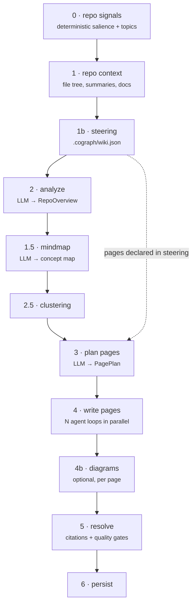

# Generated wiki

Cograph generates a documentation wiki for each repository from the indexed
snapshot. This page covers what it produces, what it refuses to produce, and —
the part that decides whether you can afford to run it — when it regenerates.

## What you get

A tree of pages, at most two levels deep, between 3 and 25 pages. The first page
is always `index`.

Each page has a **kind** drawn from a catalog of 24 — `overview`, `domain-model`,
`api-reference`, `configuration`, `key-flow`, `service-topology`, `quick-start`,
`cli-reference`, `installation`, `public-api-reference`, `migration-guide`,
`core-abstractions`, `extension-points`, `troubleshooting`, `security`,
`examples`, `concept`, and others.

Which kinds are allowed depends on what the repository *is*. Cograph classifies it
as one of eight repo kinds (`cli`, `library`, `service`, `code_generator`,
`framework`, `monorepo`, `hybrid`, `unknown`) and each kind has its own catalog —
so a library gets `public-api-reference` and a CLI gets `cli-reference`, and
neither gets the other. `index` and `overview` are always available.

## How generation works



Stages 0, 1, 2.5, 5 and 6 make **no** model calls. Stages 2, 1.5 and 3 make one
each. Stage 4 runs one agentic loop per page, four at a time — this is where
essentially all the cost is.

### Page planning is quota-driven, not free-form

The number of pages is decided deterministically before the planner runs, from
signals extracted in stage 0:

```
target = 6 + ceil(public_topics × 1.3) + ceil(supporting_topics × 0.4)
clamped to [5, 30], at most 4 pages per cluster
```

Each candidate topic gets a **salience tier**:

| Tier | Treatment |
| --- | --- |
| `public` | Eligible for a dedicated page (needs salience ≥ 0.65; docs, CLI and public-API seeds auto-qualify) |
| `supporting` | Becomes a section inside another page |
| `internal` | Collapsed into the architecture page |
| `test_scaffolding` | Filtered out **before** the model ever sees it |

If the planner produces a plan that would fail these constraints, the run fails
with a plan error. There is deliberately no deterministic fallback plan: a generic
`index / architecture / getting-started` skeleton is the failure mode this design
exists to avoid, so it surfaces in the run history instead of shipping quietly.

### Steering

Drop a `.cograph/wiki.json` (or `.yaml`) into the repository to constrain
generation:

```json
{
  "notes": ["This service owns terminal selection, not routing."],
  "pages": [
    { "slug": "fallback", "title": "Fallback behaviour",
      "notes": ["Explain the retry ladder and where it stops."] }
  ]
}
```

When `pages` is supplied, stages 2.5 and 3 are skipped entirely and your pages
become the plan verbatim. Caps are fixed and not configurable — 100 repository
notes at 10k characters each, 30 pages, 10 notes per page at 2k characters — to
bound prompt bloat and limit what a repository can inject into the deployment's
prompts. A malformed steering file never fails a regeneration; it is ignored.

## The quality contract

This is what separates the output from a plausible-sounding summary.

### Citation gate

A citation is valid only if the writing agent **verified it with a tool call** —
not merely that the symbol resolves against the graph. Every tool result the agent
sees is recorded in a per-page evidence ledger, and the gate checks each citation
against that ledger.

Failures get up to three repair passes, with the compacted ledger fed back so the
model can correct itself. If citations still do not hold, the invalid ones are
downgraded from links to plain code spans and the page ships marked
`degraded` — which also makes it dirty, so the next sync tries again.

### Coverage gate

Each page declares the reader questions it covers, drawn from a closed set:
`how-to-run`, `configuration`, `use-cases`, `dependencies`, `public-api`. Every
declared question must be answered by a marked section containing a verified
citation.

::: warning There is no "Open questions" section
A question the model cannot ground is **dropped from the page**, and the page
ships marked `partial`. It is not answered vaguely and it is not listed as an open
question. The contract forbids that section explicitly, because a page full of
hedged non-answers is worse than a shorter page that is true.
:::

`partial` pages are considered clean and are not regenerated. `degraded` pages are
regenerated on the next sync.

### Diagrams

Pages that warrant one get a Mermaid diagram synthesised in a separate pass.
Diagram failure is non-fatal — the page ships without it.

## Cost and regeneration

The expensive question is not "what does a wiki cost to build" but "what does it
cost to *keep*". Two independent reuse axes answer that.

### Axis 1 — plan reuse

The stage 2, 1.5 and 3 outputs are persisted as one artifact per repository. It is
reusable when **all four** match: the repository's structural hash, the wiki
schema version, the chat model, and the embedding model. On a hit, three LLM calls
are skipped entirely.

### Axis 2 — per-page reuse

Each page carries three stamps. A page is **clean** — zero LLM calls — when all
stamps match, every source it cited still exists, and its recorded quality is not
`degraded`.

| Stamp | What it hashes |
| --- | --- |
| `spec_hash` | The page's stable contract: slug, title, parent, covered questions, diagram flag, page kind |
| `cited_fingerprint` | Only the evidence the page **actually cited** |
| `wiki_schema_version` | The pipeline version that produced it |

Both hashes are narrower than the obvious implementation, and both narrowings
came from production regeneration storms:

- **`spec_hash` excludes `purpose` and `sources_hint`.** The planner rewords both
  non-deterministically, so hashing them made any re-plan dirty *every* page.
- **`cited_fingerprint` hashes cited evidence only, not the whole retrieved
  top-k.** The uncited tail of a retrieval churns on every push as approximate
  nearest-neighbour ranks jitter. Hashing it regenerated pages whose content had
  no reason to change.

A missing `cited_fingerprint` means **adopt, not dirty**: the value is computed and
stamped on this sync. A deploy or a skipped backfill therefore cannot trigger a
regeneration storm.

### Edit mode

When a page is dirty but barely changed, a full agentic rewrite is overkill.
Instead Cograph makes **one tool-less editor call** against the page's stored
pre-resolve body — provided all four conditions hold:

1. The stored pre-resolve body exists (a page written before edit mode shipped has
   to be fully rewritten once first).
2. The reason it is dirty is edit-eligible.
3. Churn — the share of cited nodes that vanished or changed — is at most 0.5.
4. Fewer than 3 consecutive edits so far. Three in a row forces a rewrite, which
   caps slow prose drift.

Any gate failure escalates to a full write with no agentic repair, so the worst
case is one editor call plus one full write.

### Full re-plan is adaptive, never manual

There is **no rebuild button**. A full re-plan happens when there is no reusable
artifact, the structural hash changed, or *coverage collapsed* — more than half the
pages lost the entire subject they cited.

Dirty volume alone never triggers it. Many changed pages means many page rewrites,
not a re-plan.

And even an adaptive full re-plan runs the dirty check again, so unchanged pages
are not paid for twice. Pages surviving from the previous plan are pinned to their
prior contract, and that contract is persisted, so the next sync stays clean
instead of being dirtied by the planner's rewording.

### Practical cost control

| Lever | Effect |
| --- | --- |
| Per-repository **sync schedule** | The coarsest dial. `manual` costs nothing until you ask. |
| Leaving `completion_writer` **unassigned** | No wiki, no summaries; indexing and retrieval still work. |
| Keeping the wiki **schema version** stable | A bump forces a full rebuild of every repository. |

Per-run token and cost totals are recorded per step, with wiki stages broken out
individually (`wiki.plan`, `wiki.write`, `wiki.diagram`, …). See
[Operations](/operations#cost).

::: warning There is no budget enforcement
Cost is measured, not capped. Nothing stops a sync from spending. The schedule and
the role assignment are the controls.
:::

## Reading the wiki

**In the UI** — `/repos/:host/:owner/:name/wiki`, with the page tree, breadcrumbs
and rendered diagrams.

**Over MCP** — the wiki resource serves the compact map (~2–3k tokens for a whole
repository, versus 34–98k for the full pages); `cograph_wiki_page` pulls one full
page or one named section. See [MCP server](/mcp#why-the-wiki-is-served-summarised).

**Over REST** — the page tree and individual pages, plus a
`repair-citations` endpoint that re-resolves stale citation links on a published
page without regenerating it.

## For contributors: the schema version

`WIKI_SCHEMA_VERSION` (in `backend/app/wiki/version.py`) is the invalidation lever
for everything the incremental path persists. A mismatch forces a full rebuild for
every repository — so bumping it is a decision with a bill attached.

**Bump it when** a change would alter what the model produces for the *same*
repository state: any prompt or prompt builder, writer loop semantics (turn
budgets, gates, repair flows), the spec-hash or cited-fingerprint algorithms, or
plan normalisation rules.

**Do not bump** for refactors, logging or telemetry.

Two documented carve-outs where a surface change ships **without** a bump:

1. **Reuse-key narrowing** — a hash change that only *drops* fields, making
   strictly more pages eligible for reuse. Bumping would force the very rebuild
   the change exists to avoid. Safe only when no row is compared old-formula
   against new: either a migration backfills existing stamps, or the new stamp is
   nullable and adopted lazily.
2. **A new regeneration path** — edit mode only rewrites pages the dirty predicate
   already flagged, and never touches a clean cached page, so no persisted
   artifact is invalidated.

Both edit `SURFACE_SHA_HISTORY[current]` **in place** rather than appending, and
carry `[wiki-schema-no-bump]` in the commit message.

Two guards enforce this:

- A unit test recomputes the quality-surface hash — over nine system prompts,
  eight budget constants and four hash algorithms — and compares it against the
  history entry for the current version. Changing a prompt or a gate budget
  without bumping turns it red.
- A CI script fails any pull request that touches the quality-surface modules
  without either bumping the version or carrying the escape hatch.

Recompute the hash with:

```bash
python -c "from backend.app.wiki.version import compute_quality_surface_sha as f; print(f())"
```
